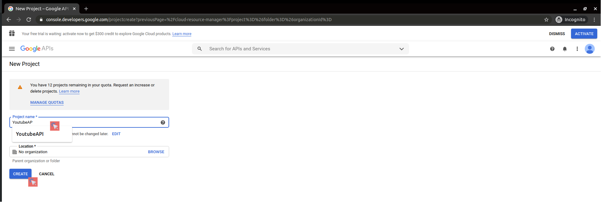
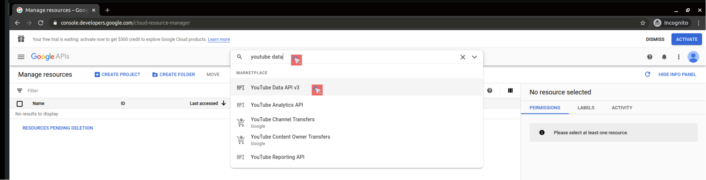
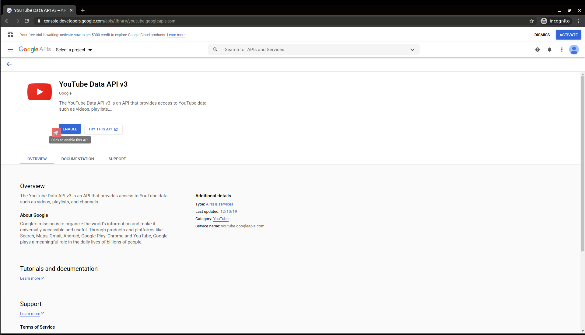
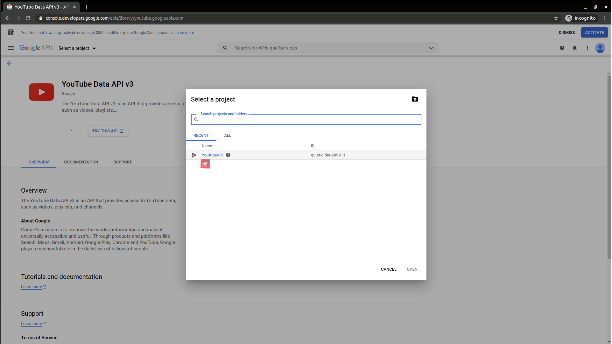
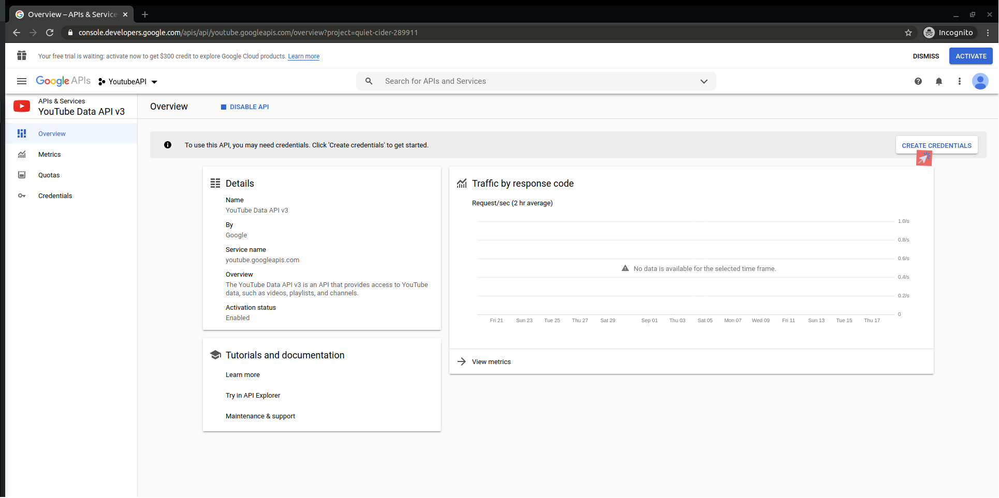
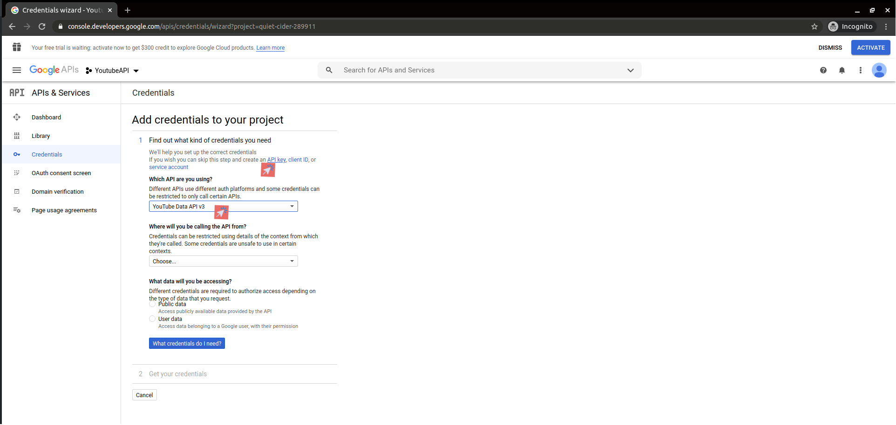
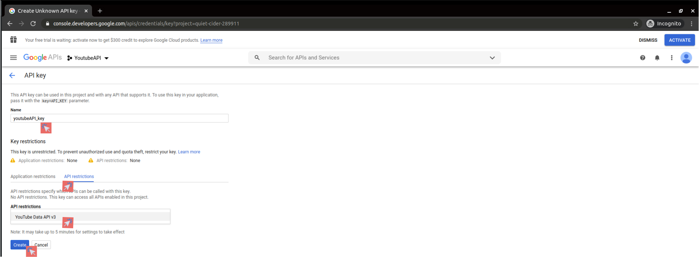
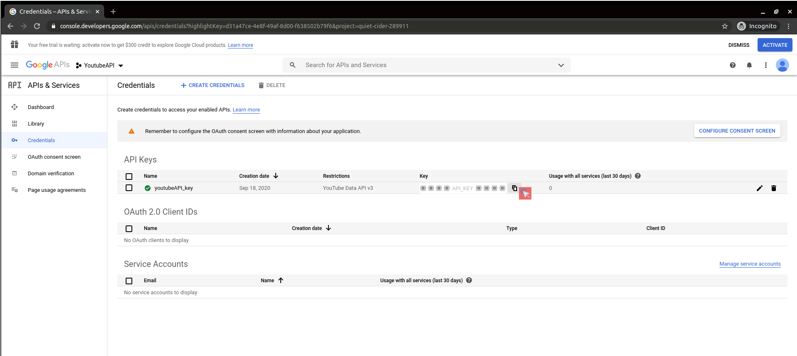

# Getting Started

## CREATE YOUTUBE API KEY
### In order to use the YouTube Data API first we need an API key
### :small_blue_diamond: Go @ [console.developers.google.com](https://console.developers.google.com/cloud-resource-manager). 

=============================================================================

### :black_small_square: Step 1 Create a new project 

### :black_small_square: Step 2 Add project Name - Hit CREATE

### :black_small_square: Step 3 Search for the YouTube Data API v3 and Enable it then Select your Project

### :black_small_square: Step 4 Create Credentials for YouTube Data API v3 and Set the API KEY

### :black_small_square: Step 5 Get the API KEY

